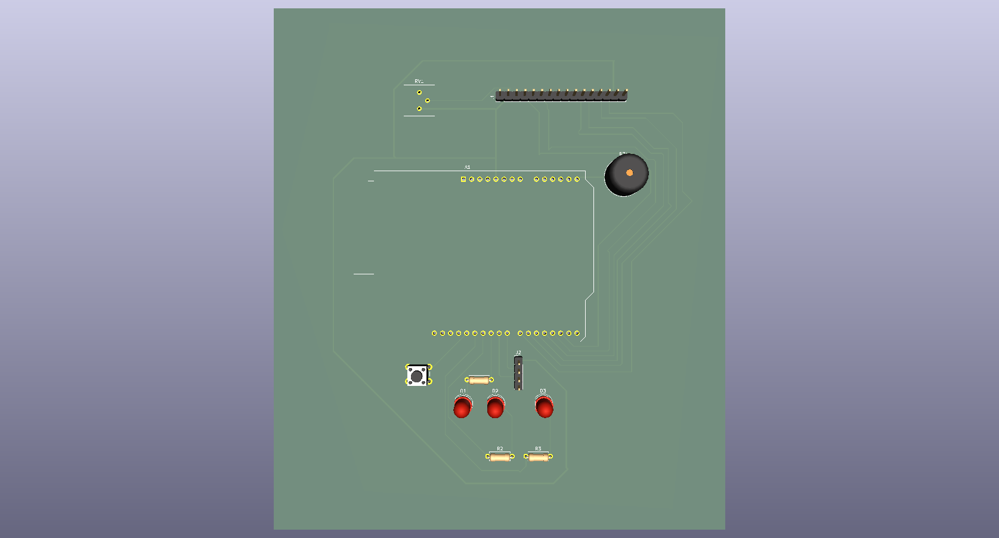

# Smart Parking Gate System & IoT Data Logger 🚗🅿️🖥️

An automated parking entrance system based on Arduino, integrated with a Python backend and a Dockerized PostgreSQL database for real-time event logging. 

This project demonstrates a complete **IoT pipeline**: from physical hardware sensors and human-machine interaction (HMI), through custom PCB design, up to serial data communication and persistent database storage.

---

## 📺 Project Presentation & Demo

Watch the system in action on YouTube:

[](DODAJ_TUTAJ_LINK_DO_YOUTUBE)

> Click the badge above to watch the project implementation and physical mechanical execution details.

---

## 🚀 Key Features

* **Ultrasonic Detection:** Automatically detects arriving vehicles within a range of 2-15 cm using the HC-SR04 sensor.
* **Interactive LCD UI:** A 20x4 character display provides real-time instructions and feedback to the driver.
* **Smooth LED Animations:** Uses PWM (Pulse Width Modulation) for professional-looking fade-in and fade-out effects on status LEDs.
* **Custom PCB Shield:** Features a tailored, 2-layer Arduino Uno Shield designed in KiCad with a solid ground plane (GND copper zone) for stable operation.
* **Smart Event Logging:** Python script (`parking_logger.py`) listens to the Arduino via USB Serial and processes system events in real time.
* **Dockerized Database:** Uses `docker-compose` to instantly spin up a PostgreSQL instance for storing entry/exit logs securely.
* **Debounced Input:** Intelligent button handling with software debouncing and edge detection to prevent accidental double-triggering.

---

## 🛠️ Hardware & PCB Design

The project has evolved from a breadboard prototype into a robust, custom-designed **Arduino Uno Shield** created in KiCad. This ensures optimal signal integrity, eliminates loose jumper wires, and makes the system deployment-ready.

### 📐 PCB View (3D Render)
The board features optimized power traces (0.50 mm), a precise potentiometer for contrast alignment, and a solid ground plane (GND Copper Zone) on the bottom layer.



### 🛠️ Hardware Components
* **Microcontroller:** Arduino Uno R3 (or compatible)
* **Custom PCB:** 2-layer Custom Shield (KiCad design files included)
* **Display:** LCD 20x4 (Hitachi HD44780 compatible)
* **Sensors:** HC-SR04 Ultrasonic Distance Sensor
* **Indications:** * Red LED (Entry blocked)
  * Green LED (Entry allowed)
  * White LED (Object in range)
  * Active/Passive Buzzer (Audio alert)
* **Input:** Tactile Push Button (Gate Close trigger)
* **Passives:** Resistors ($3 \times 220\,\Omega$), Bourns 3386P Potentiometer (LCD Contrast adjust).

---

## 💻 Software Requirements

* **Arduino IDE:** To compile and upload the `.ino` firmware.
* **Docker & Docker Compose:** To containerize and run the PostgreSQL database.
* **Python 3.x:** To execute the serial data logger.
* **Python Libraries:** `pyserial`, `sqlalchemy`, `psycopg2-binary`.

---

## 🔌 Pinout Configuration

| Component | Arduino Pin | Type | Description | Track Width |
| :--- | :---: | :---: | :--- | :---: |
| **VCC (+5V)** | `+5V` | Power | Main power rail for LCD, Sensor, and Potentiometer | **0.50 mm** |
| **GND** | `GND` | Power | Common ground plane (Bottom Copper Zone) | *Copper Zone* |
| **LCD RS** | `D2` | Output | Register Select | 0.25 mm |
| **LCD Enable** | `D3` | Output | Enable Signal | 0.25 mm |
| **LCD D4 - D7** | `D4, D5, D6, D7` | Output | Parallel Data Lines | 0.25 mm |
| **HC-SR04 Trig** | `D8` | Output | Trigger Pulse | 0.25 mm |
| **HC-SR04 Echo** | `D9` | Input | Echo Pulse | 0.25 mm |
| **Red LED** | `D10` | Output (PWM)| Status Indicator (Entry Blocked) | 0.25 mm |
| **Green LED** | `D11` | Output (PWM)| Status Indicator (Entry Allowed) | 0.25 mm |
| **White LED** | `D12` | Output | Range Warning Indicator | 0.25 mm |
| **Push Button** | `D13` | Input | Gate Close Trigger (Internal Pull-up) | 0.25 mm |
| **Buzzer** | `A5 (SCL)` | Output | Audio Alert Signal | 0.25 mm |
| **LCD Contrast**| `RV1 (Pin 2)` | Analog | Contrast adjustment connected to LCD Pin 3 | 0.25 mm |

---

## ⚙️ How to Run the Project (Quick Start)

### 1. Hardware & PCB Setup
1. Open the KiCad files in `hardware/` to inspect the schematic and PCB layout.
2. Fabricate the PCB or assemble the prototype on a breadboard according to the **Pinout Configuration** table.
3. Open `simulator-parking.ino` in the Arduino IDE and upload it to your board.
4. Note the COM port your Arduino is connected to (e.g., `COM9` or `/dev/ttyUSB0`).

### 2. Database Setup (Docker)
1. Open your terminal in the project directory.
2. Start the containerized PostgreSQL database by running:
   ```bash
   docker-compose up -d
3. Backend Data Logger Setup
Navigate to the directory containing parking_logger.py.

Configure your database connection string and correct COM port inside the script.

Run the Python application to start logging events into PostgreSQL:
python parking_logger.py

📂 Repository Structure
Plaintext
├── .github/               # GitHub workflows (if applicable)
├── arduino/               # Arduino firmware (.ino code)
│   └── simulator-parking.ino
├── backend/               # Python application & logger scripts
│   └── parking_logger.py
├── hardware/              # KiCad EDA Project files (Shield Design)
│   ├── Parking.kicad_pro
│   ├── Parking.kicad_sch
│   ├── Parking.kicad_pcb
│   ├── Parking_Schematic.pdf
│   └── Parking.png        # Gorgeous 3D view of the PCB
├── docker-compose.yml     # Docker services initialization (PostgreSQL)
└── README.md              # Documentation
👤 Author
Developer: @Freshovsky23

Contact: Heilman.Wiktor23@gmail.com